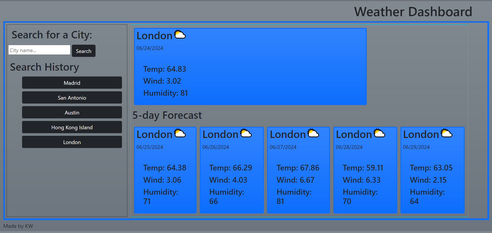

# KW06-expediavisorosityDOTCOM

## Description

A new travel company approached me about making a handy weather app their customers can use to search locations and see a 5-day weather forecast for those areas. This will help their customers pick which destination they want for the trip the book with Expediavisorosity.com!

## Installation

NA

## Usage

When a user loads the site they can type in the name of a city in the search bar, then click search. The first city that matches their search appears next to the search bar, along with it's current weather conditions. Underneath it the 5-day forecast shows what conditions will be like in that city the 5 days following the date from the section above. Also, after the user searches a city, that cities name appears as a clickable button in the Search History section.

Here's a link to the [webapp!](https://horizonbound0.github.io/KW06-expediavisorosityDOTCOM/)

## Credits

Daniel Dunnemann helped me troubleshoot my fetch requests! [Daniel Dunnemann]()

## License

This project uses the MIT license, which is available to read in the repo.